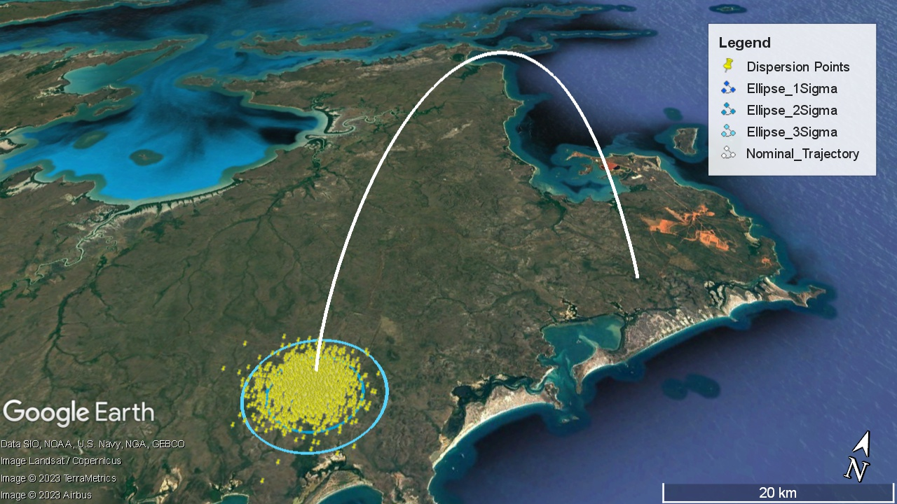
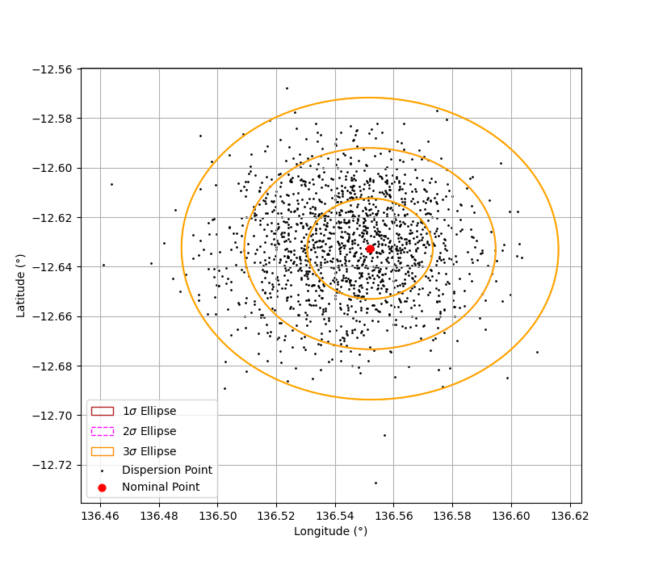

# Sounding Rocket Trajectory Visualization
The workflows outlined involve Bash and Python scripting. An installation of WSL (on Windows) with the following Python libraries are required:
- Numpy
- Scipy
- Matplotlib

Trajectory postprocessing workflow requires the following 2 items:
1. Nominal trajectory in "LAT,LONG,ALT" form written into Nominal_Trajectory.csv
2. Dispersion point data in "LONG LAT <etc>" form from the ASTOS Monte-Carlo simulation written into MC_Results.txt

Nominal_Trajectory.csv file is placed in Postprocessing/Input, while MC_Results.txt is placed in Postprocessing/Input/Monte Carlo/ folder.

Run ./Nominal_Output.sh to generate output data. The output is given in the form of .kml data. PNG file for confidence ellipses are generated as well for validation.

  
   

